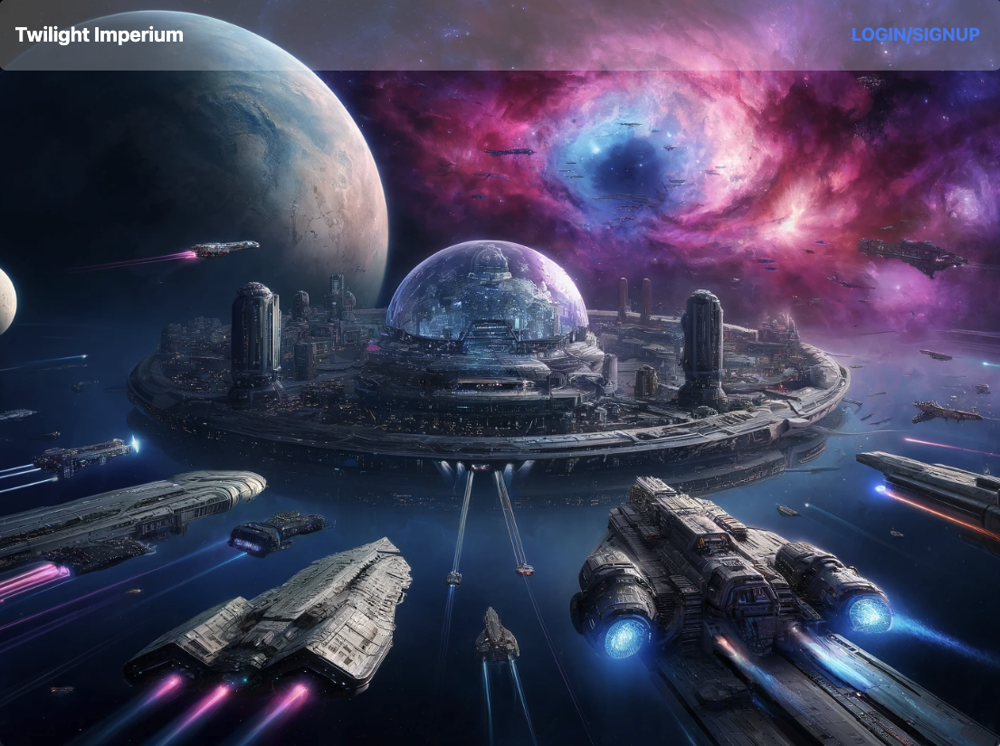
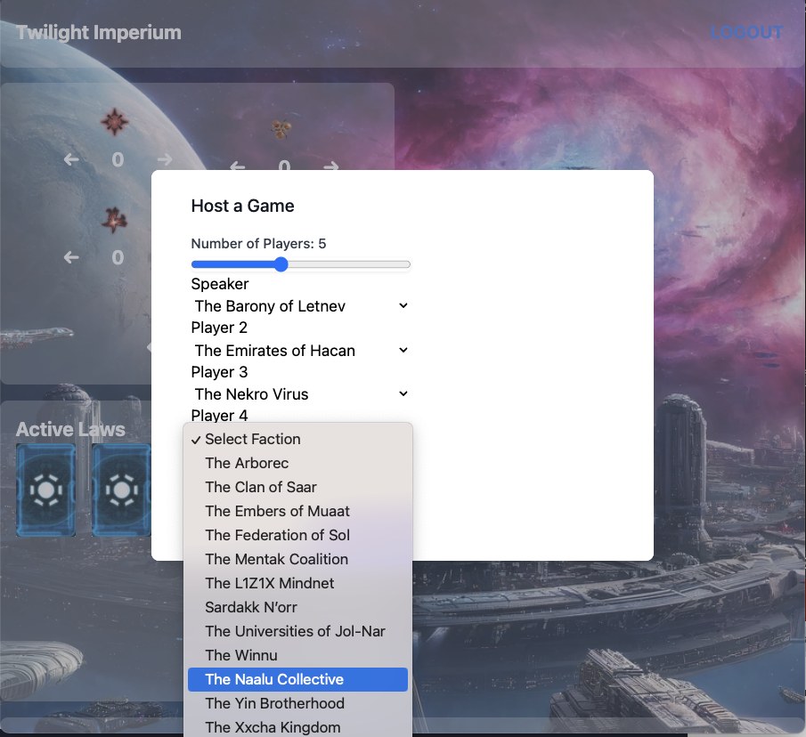
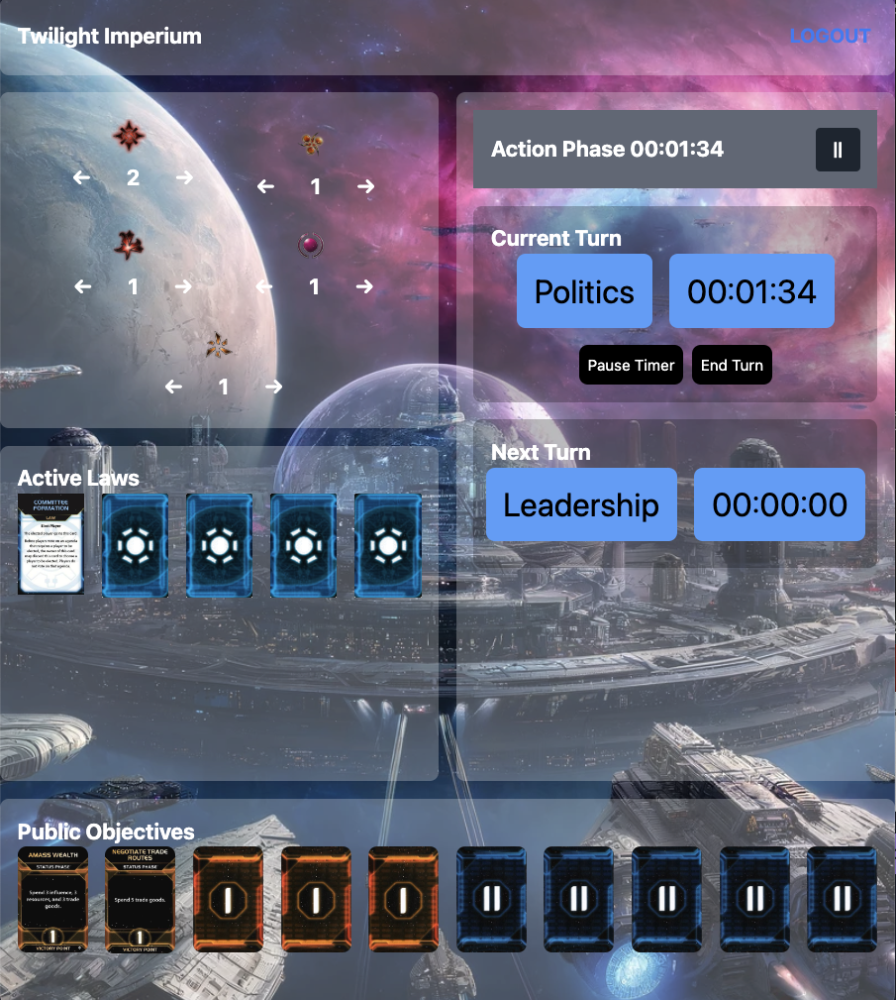

# Nekro-Files

An essential game management tool for Twilight Imperium to keep the game organized and to keep vital game information secure

---

## Technology Used 

| Technology Used         | Resource URL           | 
| ------------- |:-------------:| 

| JavaScript     | [https://developer.mozilla.org/en-US/docs/Web/JavaScript](https://developer.mozilla.org/en-US/docs/Web/JavaScript)      |   
| Git            |         [https://git-scm.com/](https://git-scm.com/)     |
| Tailwind CSS  |  [https://tailwindcss.com/](https://tailwindcss.com/) |
| MongoDB | [https://www.mongodb.com/](https://www.mongodb.com/)   | 
| Express NPM package | [https://www.npmjs.com/package/express](https://www.npmjs.com/package/express) |   
| Node.js | [https://nodejs.org/](https://nodejs.org/)     |
| React | [https://react.dev/](https://react.dev/)   |
| NPM | [https://www.npmjs.com](https://www.npmjs.com)   |

---

## Badges

---

## Description

[Visit the Github repository](https://github.com/gjudilla/nekro-files)

[Visit the deployed site](XXXXXXXXXX)

This application tracks the play of the TTRPG Twighlight Imperium 4th Edition and supports the Prophecy of Kings expansion. Once logged in the host can add the correct number of players (between 3-8), assign the correct factions to each player (which then sets the initial speaker order), and then the game can begin. During each round the phase of the game is displayed and the amount of time each player is taking to complete their turn is tracked. Also, Active Law Cards & Public Objective cards that have been played are also displayed. 

---

## Instalation

If running localy you need to do the following:
* npm install from the root folder to install all the dependencies. 
* create a .env file which must contain an environmental variable as follows: ACCESS_TOKEN_SECRET={Insert your variable name here without the brackets}
* seed the database with npm run seed
* npm run develop to run in develop mode 
--- OR ---
* npm run build && npm run start in production mode  

---

## Usage
On starting, the landing page has a navbar with a login/signup button. When clicked a modal comes up allowing you to signup with your email and a passowrd. Once signed up the user can login instead.

Once logged in the host can choose between 3-8 players, then assign each player the faction that they have chosen.

During the actual play the host keeps track of which player is active, which sets the timer to keep track of how much time that player is taking. All Active Laws and Public Objectives that have been posted are displayed.

---

## Author Info

This website was designed and implemented by:

### Jordan Ferrario
### Gabrielle Judilla
### Nicholas Padovese
### William Keyes
### Jeffrey Nelson

---

## Credits

  In this application we have used many of the strategies taught by the excellent instructors at the UC Berkeley Extension Full Stack coding bootcamp. Some of the boilerplate code has been copied. Finally, we copied open source badges from Vedant Chainani at the website https://dev.to/envoy_/150-badges-for-github-pnk#contents 

 --- 

